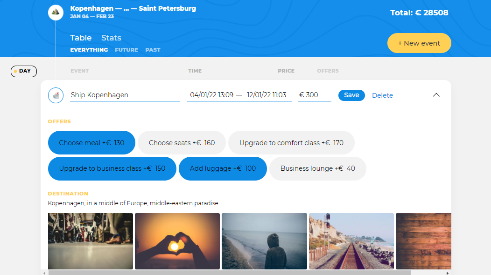

# Проект «Большое путешествие»
---
https://makaevaelena.github.io/BIG-TRIP/

---
Проект: Большое путешествие
О проекте
«Большое путешествие» — современный сервис для настоящих путешественников. Сервис помогает детально спланировать маршрут поездки, рассчитать стоимость путешествия и получить информацию о достопримечательностях. Минималистичный интерфейс не даст повода отвлечься и сфокусирует внимание на планировании путешествия.

1. Описание функциональности
Приложение состоит из двух экранов: «Маршрут поездки» и «Статистика».

1.1 Общий контейнер
Новая точка маршрута создаётся нажатием на кнопку «New Event». После нажатия пользователь видит форму создания новой точки маршрута, где ему необходимо заполнить несколько полей (о полях будет рассказано позже).
1.2 Маршрут поездки
Путешествие строится из отдельных точек маршрута. Точка маршрута — отдельное событие в путешествии. Точкой маршрута может быть остановка в каком-нибудь месте (Check-in, Sightseeing, Restaurant) или поездка на транспортном средстве (Taxi, Bus, Train, Ship, Drive и Flight).

Точка маршрута принадлежит к одному из типов: Taxi, Bus, Train, Ship, Drive, Flight, Check-in, Sightseeing, Restaurant.

Точки маршрута загружаются с сервера при старте приложения.

Точки маршрута по умолчанию располагаются сверху вниз от самых старых к самым новым по дате начала события вне зависимости от длительности: один день, меньше одного дня, больше одного дня.

В случае отсутствия точек маршрута вместо списка отображается текст: «Click New Event to create your first point».

1.3 Точка маршрута
По умолчанию точка маршрута в списке отображается в режиме просмотра.

В колонке «Time» отображается время и продолжительность нахождения в точке маршрута (разность между окончанием и началом события). Время маршрута отображается в формате начало — окончание (например, «10:30 — 11:00»). Формат продолжительности нахождения в точке маршрута зависит от длительности:

Менее часа: минуты (например, 23M);
Менее суток: часы минуты (например, 02H 44M или 12H 00M, если минуты равны нулю);
Более суток: дни часы минуты (например, 01D 02H 30M или 07D 00H 00M, если часы и/или минуты равны нулю).
В колонке «Offers» отображаются дополнительные опции, выбранные для точки маршрута.

Кнопка «Favorite» (отображается в виде звёздочки). Добавляет точку маршрута в избранное. После добавления в избранное, кнопка меняет состояние — яркая звезда. Повторный клик по кнопке удаляет точку маршрута из избранного и возвращает кнопку в исходное состояние.

1.4 Новая точка маршрута
Новая точка маршрута создаётся нажатием на кнопку «New Event». Форма создания новой точки маршрута появляется в самом начале списка. Кнопка при этом блокируется на время создания новой точки.

Если в момент нажатия на кнопку «New Event» был выбран фильтр или применена сортировка, то они сбрасываются на состояния «Everything» и по дате соответственно.

Нажатие кнопки «Esc» скрывает форму создания новой точки маршрута. Несохранённые изменения пропадают.

Нажатие на кнопку «New Event» закрывает открытую форму редактирования точки маршрута, если таковая была. Изменения при закрытии не сохраняются.

В форме создания новой точки маршрута пользователю доступны следующие элементы управления:

Кнопка «Save». Сохранение точки маршрута и закрытие формы создания точки маршрута.
Кнопка «Cancel». Отмена изменений и закрытие формы создания точки маршрута.
Для создания новой точки маршрута пользователь заполняет:

Тип точки маршрута (один из: Taxi, Bus, Train, Ship, Drive, Flight, Check-in, Sightseeing, Restaurant).
Пункт назначения. Выбирается из списка предложенных значений, полученных с сервера. Пользователь не может ввести свой вариант для пункта назначения.
Дата и время начала события. Выбор времени и даты осуществляется с помощью библиотеки flatpickr.js. Выбранная дата и время отображаются в поле в формате: день/месяц/год часы:минуты (например «25/12/2019 16:00»).
Дата и время окончания события. Формат и требования аналогичны дате начала. Дата окончания не может быть меньше даты начала события.
Стоимость. Целое положительное число.
Дополнительные опции. В зависимости от типа точки маршрута пользователь может выбрать дополнительные опции (offers).
Дополнительные опции отображаются в блоке offers. Набор дополнительных опций, которые может выбрать пользователь при создании точки маршрута, зависит от типа точки маршрута. Наборы дополнительных опций для каждого типа точки маршрута загружаются с сервера.

Пользователь может отметить одну или несколько дополнительных опций.

Дополнительная опция применяется к точке маршрута один раз. Повторный клик на дополнительную опцию отменяет её применение.

Список дополнительных опций доступен не для всех типов точек маршрута. Для некоторых типов точек дополнительные опции могут отсутствовать. В этом случае контейнер для вывода дополнительных опций не отображается.

Выбор дополнительных опций влияет на общую стоимость путешествия. Стоимость точки маршрута, которую ввёл пользователь в соответствующее поле ввода, при этом не изменяется.

При изменении типа точки маршрута выбранный ранее список дополнительных опций очищается.

После выбора пункта назначения появляется блок «Destination». В нём отображается информация о месте назначения (изображения, текст). Информация в блоке «Destination» всегда соответствует выбранному пункту назначения. При изменении пункта назначения информация в блоке «Destination» обновляется.

Информация для блока «Destination» загружается с сервера.

Если информация о пункте назначения отсутствует, блок «Destination» не отображается.

После сохранения точка маршрута располагается в списке точек маршрута в соответствии с датой начала события по этой точке.

Если дата начала двух и более точек совпадает, расположение этих точек относительно друг друга реализуется на усмотрение разработчика.

Введённые пользователем данные экранируются.

1.5 Редактирование точки маршрута
Для перехода к форме редактирования точки маршрута пользователь кликает по кнопке с изображением «Стрелка вниз» в правом углу карточки точки маршрута.

В форме редактирования пользователю доступны следующие элементы управления:

Кнопка «Save». Сохраняет изменения, закрывает форму редактирования.
Кнопка «Delete». Удаляет точку маршрута, закрывает форму редактирования.
В форме редактирования представлены все поля, которые пользователь заполняет при создании новой точки маршрута (см. раздел «Новая точка маршрута»). Правила их поведения сохраняются.

При нажатии кнопки «Esc» или кнопки с изображением «Стрелка вверх» в правом углу форма редактирования закрывается. Несохранённые изменения пропадают.

Одновременно может быть открыта только одна форма создания/редактирования.

При смене типа точки маршрута блок с дополнительными опциями перерисовывается, если у нового выбранного типа точки есть опции; или скрывается, если опций нет. Остальные данные, введённые пользователем, должны быть сохранены.

При смене пункта назначения блок с описанием перерисовывается; или скрывается, если у пункта назначения нет описания и фотографий к нему. Остальные данные, введённые пользователем, должны быть сохранены.

Если пользователь внёс изменения в точку маршрута, не выполнил сохранение и пытается перейти к редактированию другой точки маршрута либо создать новую, то в этом случае открытая форма редактирования скрывается без сохранения изменений. После открывается другая форма редактирования или форма создания новой точки маршрута.

После сохранения изменений точка маршрута располагается в списке точек маршрута в порядке, определённом текущей сортировкой (по дате, по длительности или по стоимости).

1.6 Фильтры
В приложении предусмотрено несколько фильтров:

Everything — полный список точек маршрута;
Future — список запланированных точек маршрута, т. е. точек, у которых дата начала события больше или равна текущей дате;
Past — список пройденных точек маршрута, т. е. точек у которых дата окончания маршрута меньше, чем текущая.
Точки маршрута, у которых дата начала меньше текущей даты, а дата окончания — больше, отображаются во всех трёх списках: Everything, Future и Past.

Выбор любого из фильтров приводит к отрисовке только тех точек маршрута, которые соответствуют выбранному фильтру.

Если в отфильтрованном списке были удалены все точки маршрута, вместо списка отображается соответствующий текст. Например, если пользователь удалил все точки маршрута из списка Past, вместо списка должна появиться заглушка «There are no past events now». Все фразы приведены в файле в директории с разметкой.

При переключении на экран статистики фильтрация сбрасывается на состояние Everything, а сами фильтры скрываются.

1.7 Сортировка
Пользователю доступна возможность сортировки точек маршрута по стоимости (клик по заголовку колонки «Price») и длительности (клик по заголовку колонки «Time»). Сортировка работает в одном направлении — от максимального к минимальному: при сортировке по стоимости в начале списка окажутся самые дорогие точки маршрута, при сортировке по длительности — самые долгие.

Для отмены сортировки и возвращению к исходной сортировке по датам пользователь кликает по заголовку колонки «Day».

При смене фильтра или переключении с экрана со списком точек маршрута на экран статистики и обратно сортировка сбрасывается на состояние «Day».

1.8 Статистика
Статистика «Stats» позволяет пользователю проанализировать расходы и время, затраченное на путешествие. Для удобства просмотра и анализа эта информация представлена в виде нескольких диаграмм: «Money» (финансовые расходы по каждому типу точек маршрута), «Type» (количество того или иного типа точки маршрута) и «Time» (затраченное время относительно типа точки маршрута). То, как должны выглядеть диаграммы, показано на изображении «Пример диаграмм» в разметке.

Для просмотра статистики пользователь нажимает на кнопку «Stats».

Диаграмма «Money» показывает финансовые затраты в разрезе точек маршрута. Она позволяет ответить на вопрос: «Сколько за время путешествия было в сумме потрачено на такси или рестораны?» Диаграмма «Money» не учитывает дополнительные опции, только стоимость точек маршрута.

Диаграмма «Type» показывает статистику по типам точек маршрута. Диаграмма отвечает на вопрос: «Сколько раз нам придётся воспользоваться самолётом, сколько раз арендовать отель и так далее».

Диаграмма «Time» показывает, сколько времени было затрачено на каждый тип точки маршрута. Диаграмма позволяет ответить на вопрос: «Сколько дней, часов и минут в сумме пользователь проведёт в самолёте, такси, ресторане и так далее». Формат общего времени, проведённого в точках маршрута, совпадает с форматом продолжительности нахождения в точке маршрута на главной странице.

Во всех диаграммах столбцы располагаются по значению: от большего значения.

1.9 Взаимодействие с сервером
Сервер расположен по адресу https://16.ecmascript.pages.academy/big-trip/.
Каждый запрос к серверу должен содержать заголовок Authorization со значением Basic ${случайная строка}. Например, Basic er883jdzbdw. Случайная строка формируется однократно при старте приложения.
Ниже описаны структуры данных, которые отдаёт или принимает сервер, и доступные методы для обращения. Путь, указанный рядом с методом, — это часть адреса, по которому нужно обращаться к серверу. Например, по адресу https://16.ecmascript.pages.academy/big-trip/points можно сделать GET-запрос, чтобы получить все точки маршрута, а можно сделать POST-запрос, чтобы отправить созданную пользователем точку маршрута.
1.9.1 Ресурсы
Структуры данных:
Destination:
{
  "description": "Chamonix, is a beautiful city, a true asian pearl, with crowded streets.",
  "name": "Chamonix",
  "pictures": [
    {
      "src": "http://picsum.photos/300/200?r=0.0762563005163317",
      "description": "Chamonix parliament building"
    }
  ]
}
Offer:
{
  "type": "taxi",
  "offers": [
    {
      "id": 1,
      "title": "Upgrade to a business class",
      "price": 120
    }, {
      "id": 2,
      "title": "Choose the radio station",
      "price": 60
    }
  ]
}
Offer.type — одно из следующих значений:
["taxi", "bus", "train", "ship", "drive", "flight", "check-in", "sightseeing", "restaurant"]
Point:
{
  "base_price": 1100,
  "date_from": "2019-07-10T22:55:56.845Z",
  "date_to": "2019-07-11T11:22:13.375Z",
  "destination": $Destination$,
  "id": "0",
  "is_favorite": false,
  "offers": $Array<Offer>$,
  "type": "bus"
}
Point.type — одно из следующих значений:
["taxi", "bus", "train", "ship", "drive", "flight", "check-in", "sightseeing", "restaurant"]
LocalPoint:
{
  "base_price": 222,
  "date_from": "2019-07-10T22:55:56.845Z",
  "date_to": "2019-07-11T11:22:13.375Z",
  "destination": $Destination$,
  "is_favorite": false,
  "offers": $Array<Offer>$,
  "type": "taxi"
}
AuthorizationError:
{
  "error": 401,
  "message": "Header Authorization is not correct"
}
NotFoundError:
{
  "error": 404,
  "message": "Not found"
}
Точки маршрута /points
GET /points
Код ответов:
200 OK;
401 Unauthorized.
Пример:

Request:

URL: GET /points;
Headers: Authorization: Basic kTy9gIdsz2317rD.
Response:

Status: 200 OK;
Body: массив из элементов вида Point.
Request:

URL: GET /points.
Response:

Status: 401 Unauthorized;
Body: структура AuthorizationError.
POST /points
Создание новой точки маршрута.

Код ответов:
200 OK;
401 Unauthorized.
Пример:

Request:
URL: POST /points;
Headers: Authorization: Basic kTy9gIdsz2317rD;
Body: структура LocalPoint.
Response:
Status: 200 OK;
Body: структура Point.
PUT /points/: id
Редактирование точки маршрута.

Код ответов:
200 OK;
401 Unauthorized;
404 Not found.
Пример:

Request:
URL: PUT points/31;
Headers: Authorization: Basic kTy9gIdsz2317rD;
Body: структура Point.
Response:
Status: 200 OK;
Body: структура Point.
DELETE /points/: id
Удаление точки маршрута.

Код ответов:
200 OK;
401 Unauthorized;
404 Not found.
Пример:

Request:
URL: DELETE points/31;
Headers: Authorization: Basic kTy9gIdsz2317rD.
Response:
Status: 200 OK;
Body: текст OK.
Пункты назначения /destinations
GET /destinations
Получение доступных точек маршрута.

Код ответов:
200 OK;
401 Unauthorized.
Пример:

Request:
URL: GET /destinations;
Headers: Authorization: Basic kTy9gIdsz2317rD.
Response:
Status: 200 OK;
Body: массив из элементов вида Destination.
Общий список дополнительных предложений /offers
GET /offers
Код ответов:
200 OK;
401 Unauthorized.
Пример:

Request:
URL: GET /offers;
Headers: Authorization: Basic kTy9gIdsz2317rD.
Response:
Status: 200 OK;
Body: массив из элементов вида Offer.
1.10 Обратная связь интерфейса
На время загрузки вместо маршрута нужно вывести информационное сообщение.

При нажатии на кнопки «Save», «Delete» формируется запрос к серверу на добавление/изменение/удаление данных. На время выполнения запроса текст заголовка кнопки изменяется:

«Save» -> «Saving...»
«Delete» -> «Deleting...»
Заголовки кнопок возвращаются в исходный вид после завершения запроса.

В момент отправки запроса на создание/удаление/изменение данных по точке маршрута форма блокируется от внесения изменений. Разблокировка формы происходит после завершения выполнения запроса (неважно, успешно выполнен запрос или нет).

Если запрос не удалось выполнить (сервер недоступен, произошла ошибка), форма редактирования/создания остаётся открытой, к ней применяется эффект «покачивание головой».

Обновление элементов (удаление точки маршрута, обновление точки маршрута и т.д) в DOM происходит только после успешного выполнения запроса к серверу.

2. Дополнительные задания
Обратите внимание, если вы планируете оживление наименования маршрута, дат и общей стоимости путешествия, добавьте этот блок в разметку в вашем проекте.

Наименование маршрута путешествия формируется автоматически и состоит из пунктов назначения (названий городов), разделённых тире: «Amsterdam — Geneva — Chamonix». Если городов больше 3-х, то в наименовании маршрута отображается первый и последний город, разделённые многоточием: «Amsterdam —... — Chamonix».

Даты путешествия в шапке заполняются автоматически. Дата начала всего путешествия соответствует дате начала первой точки маршрута. Дата окончания — дате завершения последней точки маршрута. Например, «18 AUG — 6 OCT».

Общая стоимость путешествия пересчитывается при создании/изменении/удалении любой точки маршрута.

Кнопка фильтра становится недоступной, если фильтру не соответствует ни одна из точек маршрута.

3. Разное
В зависимости от состояния, некоторым элементам управления применяются соответствующие классы оформления. Например, активный фильтр и так далее. Примеры доступны в директории с вёрсткой (markup).
